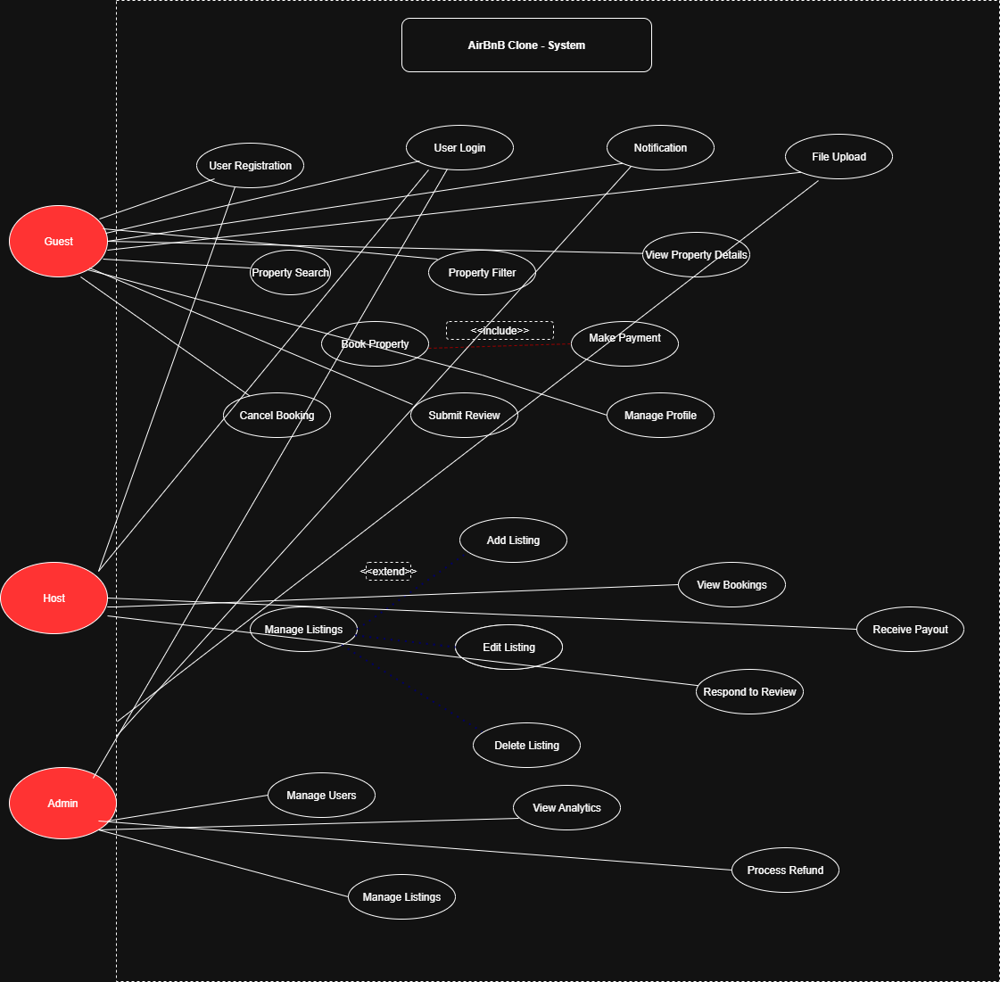

### Airbnb Clone: Use Case Diagram

The diagram below maps the core functionalities of the application to its main users (actors), showing how each user interacts with the system.

#### 1. Actors

-   Guest: An individual who books properties.
-   Host: A user who lists and manages properties.
-   Admin: A privileged user who manages the entire platform.

#### 2. Use Cases and Their Relationships

##### Guest Use Cases

-   Search for Property: A guest can search for properties by location, dates, and other criteria.
-   Filter Listings: They can refine their search using filters for price, amenities, etc.
-   View Property Details: A guest can view detailed information about a specific property.
-   Book a Property: This is the core action of a guest, initiating a booking request.
    -   Includes Make Payment, as a booking requires payment.
-   Cancel Booking: A guest can cancel a confirmed booking.
-   Submit Review: After their stay, a guest can leave a review and rating for the property.
-   Manage Profile: A guest can update their personal information and profile picture.

##### Host Use Cases

-   Manage Listings: This is the primary function for a host, encompassing multiple actions.
    -   Extends to Add Listing, Edit Listing, and Delete Listing.
-   View Bookings: A host can see all upcoming and past bookings for their properties.
-   Manage Profile: A host can update their profile details.
-   Respond to Review: Hosts can respond to reviews left by guests.
-   Receive Payout: The system automatically processes payouts to hosts after a booking is completed.

##### Admin Use Cases

-   Manage Users: An admin can view, edit, or suspend user accounts.
-   Manage Listings: An admin can moderate or remove inappropriate property listings.
-   View Analytics: An admin can monitor platform-wide data, such as bookings and revenue.
-   Process Refunds: An admin can handle special cases for payment refunds.

#### 3. General Use Cases (Shared)

-   User Registration: Both Guests and Hosts use this to create an account.
-   User Login: All actors (Guest, Host, Admin) use this to access their accounts.
-   Notifications: The system sends notifications to both Guests and Hosts regarding bookings, payments, and other updates.
-   File Upload: Both Guests and Hosts can upload images (e.g., profile pictures, property photos).

This diagram provides a clear overview of the system's intended behavior, highlighting the distinct and shared responsibilities of each user type within the Airbnb Clone platform.

